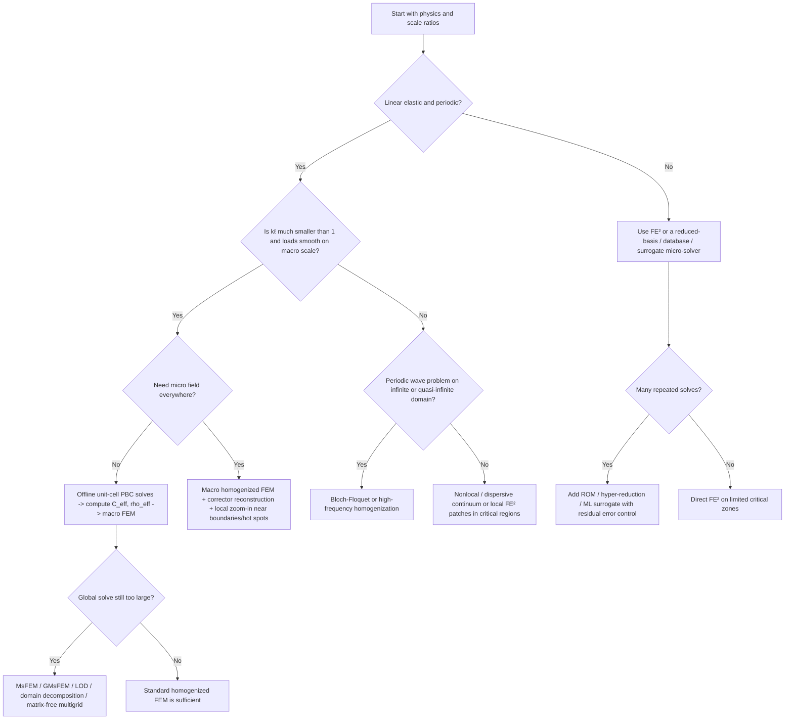

# Displacement Fields in Large-Scale Multiscale FEM with Precomputed Periodic Unit Cells

## Executive summary

For a heterogeneous periodic solid, replacing the true medium by a homogeneous one with effective stiffness \( \mathbf C_{\mathrm{eff}} \) and effective density \( \rho_{\mathrm{eff}} \) is mathematically justified only in an asymptotic sense: the microstructured displacement field \(u^\varepsilon\) converges to a homogenized field \(u^0\), and the *strong* approximation generally requires adding an oscillatory corrector \( \varepsilon u_1(x,x/\varepsilon) \). In other words, a plain homogeneous medium does **not** usually reproduce the exact pointwise microscopic displacement field; it reproduces the macroscopic field and averaged energetics/fluxes, and it can reproduce local fields only after downscaling with correctors, plus boundary-layer corrections near outer boundaries. This is the central takeaway from asymptotic homogenization and two-scale convergence. citeturn10view0turn9view1turn0search11

The replacement is most reliable for linear, uniformly elliptic, scale-separated media with periodic or locally periodic microstructure, under smoothly varying loads and in frequency regimes where the cell size is much smaller than the relevant macroscopic length scale or wavelength. In dynamics, the classical local model with constant \( \mathbf C_{\mathrm{eff}} \) and \( \rho_{\mathrm{eff}} \) is a low-frequency, long-wavelength approximation. Bloch-wave and dispersive homogenization show that once wavelengths become comparable to the cell size, or one operates near standing-wave frequencies, Brillouin-zone edges, band gaps, or local resonances, the correct effective model is typically dispersive and often nonlocal rather than a simple Cauchy continuum. citeturn13search2turn8view4turn13search1turn27search14

For practical computation of displacement fields, there is a sharp divide between methods that compute only effective constitutive data and methods that preserve or reconstruct fine-scale fields. If the objective is a global displacement field for a very large structure and the full fine-scale FEM would exceed feasible memory or wall-clock budgets, the most effective workflow is usually: compute unit-cell problems with periodic boundary conditions offline; solve a coarse homogenized FEM online; then reconstruct microscale displacements only where needed using correctors or local submodels. If the material is nonlinear, path-dependent, or strongly wave-dispersive, one moves toward FE\(^2\), FE-HMM, reduced-basis or database models, or Bloch/nonlocal formulations. citeturn29view0turn12search22turn31view0turn21search11turn28search3

Among the multiscale finite-element families, FE\(^2\) is the most general but also the most expensive because it solves a microscale boundary value problem at each active macroscale material point. MsFEM, GMsFEM, FE-HMM, and localized-orthogonal-decomposition-type methods reduce this burden by precomputing basis functions, correctors, or sampled micro-stiffness contributions, often with better theoretical error control than classical FE\(^2\). Domain decomposition and mortar methods are not homogenization theories by themselves, but they are crucial scalability tools when coupling large subdomains, nonmatching meshes, and localized fine-scale patches. citeturn0search2turn19view0turn16search6turn31view0turn18search14

For problems so large that a full fine-scale matrix or its factorization would be in the \(>\)TB regime, the realistic alternatives are methods that avoid assembling or storing the fine-scale global operator altogether: homogenized FEM with corrector reconstruction, matrix-free multigrid/high-order FEM, FFT- or spectral-based cell solvers for periodic media, Bloch-Floquet decomposition for waves in periodic structures, reduced-order micro-solvers, and carefully validated machine-learning surrogates. Hierarchical matrices and fast multipole methods are especially compelling when the governing operator is dense or integral-equation based, as in BEM, rather than a standard sparse volume FEM. citeturn4search4turn32search3turn13search3turn25search2turn26search7turn28search0turn17search15

## Homogenization theory and field equivalence

Consider linear elasticity with periodic microstructure,
\[
-\nabla\!\cdot \big(\mathbf C(x/\varepsilon):\varepsilon(u^\varepsilon)\big)=f
\quad\text{in }\Omega,
\]
where \(\varepsilon=\ell/L\) is the micro-to-macro scale ratio, \(\ell\) the cell size, and \(L\) a macroscopic characteristic length. Two-scale convergence gives the canonical limit structure
\[
u^\varepsilon \rightharpoonup u^0, \qquad
\nabla u^\varepsilon \xrightarrow{2\text{-scale}} \nabla_x u^0 + \nabla_y u_1(x,y),
\]
and the local field behaves as
\[
u^\varepsilon(x)\approx u^0(x)+\varepsilon\,u_1\!\left(x,\frac{x}{\varepsilon}\right).
\]
Allaire’s lecture notes make this especially explicit: the microscopic corrector \(u_1\) is what upgrades weak convergence of \(u^\varepsilon\) into strong convergence of \(u^\varepsilon-u^0-\varepsilon u_1(x,x/\varepsilon)\). That is the rigorous mathematical reason why the homogeneous field \(u^0\) alone is generally **not identical** to the true displacement field except in degenerate situations where the corrector vanishes. citeturn10view0turn9view1turn30view0

In the periodic linear-elastic cell problem, one prescribes a macroscopic strain \(\mathbf E\) and solves on the unit cell \(\mathcal A\)
\[
\operatorname{div}\sigma = 0,\qquad
\sigma=\mathbf C(y):(\mathbf E+\nabla^s v),
\]
with \(v\) periodic and the traction \(\sigma n\) anti-periodic on opposite faces. The averaged stress then defines the homogenized tensor by
\[
\mathbf \Sigma=\langle \sigma\rangle = \mathbf C^{\mathrm{hom}}:\mathbf E.
\]
This is the standard first-order periodic homogenization setting used both in mathematical homogenization and in finite-element implementations. citeturn29view0turn6search10

Asymptotic homogenization, two-scale convergence, and Bloch-wave methods are best understood as complementary rather than competing. Two-scale convergence is the rigorous compactness framework introduced by Nguetseng and synthesized by Allaire; asymptotic expansions give explicit cell problems and effective coefficients; Bloch-wave homogenization combines two-scale ideas with Floquet-Bloch spectral decomposition and is particularly natural for periodic wave problems. Allaire and Conca explicitly describe Bloch-wave homogenization as a combination of two-scale convergence and Bloch decomposition. citeturn0search7turn0search11turn8view4

The strongest conditions under which a homogeneous replacement is accurate for *displacement fields* are therefore not “same pointwise field,” but rather: periodic or locally periodic coefficients; linearity or incremental linearization; uniform ellipticity; small \(\varepsilon\); sufficiently regular load data; and interest in the macroscale field, averaged stress, or a corrected field obtained by localization. Boundary layers matter because outer boundaries destroy pure periodicity. Allaire and others show that boundary-layer effects can be negligible for some interior first-order estimates, but not generally in higher-order or near-boundary estimates; Gérard-Varet and Masmoudi further show that boundary-layer phenomena can even modify the homogenized boundary behavior itself. citeturn33search1turn2search4turn33search14

For loading type, the asymptotic theory is most favorable when forcing and boundary data vary only on the macroscale. Smooth body forces, smooth tractions, and slowly varying Dirichlet data fit the theory best. Concentrated loads, contact patches, geometric re-entrant corners, cracks, and other singular features introduce local fields whose variation is on the same order as the microstructure; then the homogenized field remains useful globally, but local displacement recovery requires submodeling, special enrichment, or direct microscale computation in those critical zones. This is not a contradiction of homogenization; it is a breakdown of the scale-separation premise in a localized region. citeturn19view0turn22view0turn33search14

For waves, the corresponding criterion is \(k\ell\ll 1\), where \(k\) is a typical wavenumber. Santosa and Symes derived an effective medium from a Bloch expansion assuming the ratio between cell size and the shortest wavelength is small, but they also showed that the effective medium is dispersive. Thus, even in nominally long-wave regimes, a local constant-\(\mathbf C_{\mathrm{eff}}\), constant-\(\rho_{\mathrm{eff}}\) model is only the leading-order description of transient propagation. Once one approaches band structure features—standing waves, Brillouin-zone edges, band gaps, local resonances—high-frequency homogenization or full Bloch-Floquet analysis is more appropriate than classical static-style homogenization. citeturn13search2turn13search14turn13search1turn13search21

A clean way to summarize the “identical displacement field” question is this:  

| Regime | What a homogeneous model can reproduce |
|---|---|
| Static or quasistatic, \(\varepsilon\ll 1\), smooth macroscale loading | \(u^0\), averaged stresses/energies, and \(u^\varepsilon\) only after corrector-based downscaling |
| Finite domain but away from boundaries and singularities | Interior corrected field can be asymptotically accurate |
| Near external boundaries or local singular loads | Boundary-layer and localization errors make plain homogenization insufficient |
| Low-frequency waves, \(k\ell\ll 1\) | Leading-order envelope; sometimes also low-order dispersion corrections |
| Near Bragg scattering, band gaps, resonances | Need Bloch, high-frequency, or nonlocal/dispersive models |

This summary condenses the classical corrector theory, boundary-layer results, and Bloch/dispersive wave homogenization literature. citeturn10view0turn2search4turn8view4turn13search2turn13search1

## Multiscale FEM methods and tradeoffs

The central practical distinction is whether the microscale is used only **offline** to produce effective operators, or solved **online** during the structural analysis. First-order periodic homogenization with precomputed unit-cell stiffness is the cheapest online route. FE\(^2\) is the most direct online route. FE-HMM, MsFEM, GMsFEM, localized orthogonal decomposition, and reduced-basis variants occupy the large middle ground between those extremes. citeturn29view0turn12search22turn31view0turn16search1turn16search6

The standard cell-level constitutive computation under periodic boundary conditions is already a reduced model: in 3D one solves six unit-strain load cases to recover the homogenized elasticity tensor; in 2D plane strain or plane stress, three cases suffice. This is very attractive when the microstructure is truly periodic, material behavior is linear, and the purpose is a macroscale displacement field, not a full fine-scale field everywhere. Commercial and research implementations of this workflow are routine. citeturn29view0turn6search15

Table 1 compares the methods most relevant to your use case.

| Method | Core idea | Typical online cost trend | Memory trend | Best use case | Main limitation |
|---|---|---:|---:|---|---|
| Homogenized FEM with precomputed periodic unit cell | Offline cell solves give \(\mathbf C_{\mathrm{eff}}\) and possibly correctors; online solve is standard macro FEM | One macro solve only | Very low; store macro mesh + effective tensors | Linear periodic media; low-frequency waves; very large structures | No pointwise micro field unless localized reconstruction is added |
| FE\(^2\) | Solve an RVE at each active macro quadrature point / Newton step | Very high; scales with number of macro material points times micro solve cost | High, especially with history variables or cached tangents | Nonlinear, path-dependent, finite strain, evolving microstructure | Often far too expensive for truly large domains |
| FE-HMM | Replace homogenized quadrature by micro sampling on microdomains; energy-equivalent two-scale FEM | High but structured; similar macro–micro nesting with stronger analysis | Moderate to high | Elliptic and wave homogenization with rigorous error control | More intrusive implementation than plain homogenized FEM |
| MsFEM / GMsFEM / LOD | Build multiscale basis functions or localized correctors offline; solve sparse coarse problem online | Low to moderate after offline stage | Moderate; basis storage dominates | Rough coefficients, high contrast, many repeats, partial lack of scale separation | Basis construction and patch design require care |
| Variational multiscale | Decompose coarse and fine scales variationally; often realized through residual-free bubbles or localized fine models | Problem dependent | Problem dependent | Stabilized multiscale formulations; conceptual bridge to MsFEM | Often a framework rather than a turnkey constitutive workflow |
| Reduced-basis / hyper-reduced micro-solvers | Learn low-dimensional micro state space and accelerate FE\(^2\)-style updates | Low to moderate per material point after training | Low online; offline training storage can be large | Repeated solves, parameter studies, nonlinear multiscale problems | Training coverage and certification become critical |
| Domain decomposition / mortar coupling | Split huge domain into subdomains; use interface solvers and nonmatching-grid coupling | Good parallel scalability; interface iteration cost | Distributed, scalable | Massive simulations, local zoom-ins, nonmatching meshes, hybrid coarse-fine domains | Does not itself provide homogenization; needs a multiscale model inside subdomains |

The algorithmic characterizations and complexity trends in Table 1 synthesize the seminal FE\(^2\) and computational-homogenization papers of Feyel–Chaboche, Miehe, Kouznetsova, and Ozdemir, the HMM/FE-HMM line of E–Engquist–Vanden-Eijnden, Abdulle, Eidel–Fischer, the MsFEM line of Hou–Wu and later oversampling/error work, GMsFEM for elasticity, the variational multiscale framework of Hughes, reduced-basis FE-HMM and reduced-basis hybrid homogenization, and mortar/domain-decomposition work in elasticity. citeturn12search22turn12search3turn12search13turn12search4turn8view2turn31view0turn0search2turn19view1turn16search6turn3search14turn21search11turn17search7turn18search14

A few method-specific points matter for displacement reconstruction. First, FE\(^2\) naturally gives full micro displacement fields, but only locally at each active RVE; global storage of all those fields is usually prohibitive, so in practice one stores only essential micro states and reconstructs detailed fields on demand. Second, FE-HMM and related HMM formulations are especially attractive when one wants a mathematically controlled compromise between offline homogenization and fully concurrent FE\(^2\). Eidel and Fischer emphasize that FE-HMM can be interpreted as macrostiffness estimation by stiffness sampling on heterogeneous microdomains, with explicit a priori estimates and optimal micro-macro refinement strategies. citeturn31view0

Third, classical MsFEM is efficient but historically suffered from resonance errors when the coarse element size interacts unfavorably with the microscale. Oversampling and constrained oversampling were developed precisely to reduce or remove those effects. Henning and Peterseim’s analysis is important here because it provides a rigorous oversampling strategy without resonance effects and explicitly connects the construction to variational multiscale ideas. citeturn20view3turn19view1turn30view1

Fourth, the “precomputed unit-cell stiffness” idea extends far beyond a single constant \(\mathbf C_{\mathrm{eff}}\). It also underlies offline-online strategies such as RB-FE-HMM, localized orthogonal decomposition with periodic reference cells and local defects, and database-driven constitutive surrogates. In those methods, one does not merely precompute one effective tensor; one precomputes basis functions, local stiffness contributions, or a constitutive database over parameter space. This is often the best compromise when the structure is large but the microstructure varies over a controlled parameter family. citeturn16search1turn21search11turn15search3turn28search3

## Error bounds and indicators

The most rigorous statement for displacement-field error in classical periodic homogenization is not that \(u^\varepsilon\approx u^0\), but that
\[
u^\varepsilon - u^0 - \varepsilon u_1\!\left(x,\frac{x}{\varepsilon}\right)\to 0
\quad\text{strongly in }H^1,
\]
under standard assumptions for the periodic elliptic setting. This means the natural *modeling error* for displacement fields is the corrector error
\[
e_{\mathrm{corr}} := u^\varepsilon - u^0 - \varepsilon u_1(x,x/\varepsilon),
\]
not simply \(u^\varepsilon-u^0\). Interior error estimates of order \(O(\varepsilon)\) are available in periodic homogenization, while boundary layers complicate global estimates and can dominate near \(\partial\Omega\). citeturn10view0turn33search8turn2search4turn33search14

For plain homogenized FEM, the dominant practical indicators of displacement accuracy are therefore: the scale-separation ratio \(\varepsilon=\ell/L\); the distance of the point of interest to boundaries and singularities; and, in dynamics, the nondimensional frequency/wavenumber indicators \(k\ell\) or \(\omega\ell/c\). These are not arbitrary heuristics; they are direct reflections of the assumptions underlying the convergence and dispersive homogenization results. When any of them is \(O(1)\), expecting a local constant-\(\mathbf C_{\mathrm{eff}}\), constant-\(\rho_{\mathrm{eff}}\) model to reproduce displacements is no longer defensible. citeturn10view0turn13search2turn13search1

For MsFEM with oversampling, Ming and Song give a Strang-type energy estimate
\[
\|u^\varepsilon-u_h\|_h
\le C\Big(
\inf_{v\in V_h^0}\|u^\varepsilon-v\|_h
+
\sup_{w\in V_h^0}\frac{\big|\langle f,w\rangle-a_h(u^\varepsilon,w)\big|}{\|w\|_h}
\Big),
\]
and then bound the approximation and consistency errors by terms involving \(h\), \(\varepsilon\), and regularity of the homogenized solution. In the periodic elliptic case they obtain, under regularity assumptions, approximation and consistency terms scaling like
\[
(\sqrt{\varepsilon}+h)\|\nabla u_0\|_{H^1}
+\frac{\varepsilon}{h}\|\nabla u_0\|_{L^2},
\qquad
(\varepsilon+\varepsilon/h)\big(\|\nabla u_0\|_{H^1}+\|f\|_{L^2}\big),
\]
which transparently displays the classical MsFEM tradeoff and the source of resonance-type behavior when \(h\) is not chosen consistently with \(\varepsilon\). citeturn20view0

For FE-HMM, the major advantage is that the micro and macro discretization errors are built into the theory. Eidel and Fischer emphasize that FE-HMM inherits a priori estimates and optimal uniform micro-macro refinement strategies from the HMM framework, and that these estimates are a distinguishing strength compared with classical FE\(^2\). For long-time wave propagation, Abdulle, Grote, and Stöhrer define the HMM consistency term
\[
e_{\mathrm{HMM}}
=
\sup_{K\in\mathcal T_H,\;1\le j\le J}
\big|a^0(x_{K,j})-a^0_K(x_{K,j})\big|,
\]
and obtain macro errors of the form
\[
\|u_0-u_H\|_{L^2} \lesssim H^{\ell+1}+e_{\mathrm{HMM}}+\varepsilon^2,
\]
with corresponding first-order behavior in the \(H^1\)-type norm on finite times, together with the ability to capture long-time dispersive effects on intervals of order \(T/\varepsilon^2\) when the scheme is refined consistently. citeturn31view0turn24view2turn24view4turn24view3

A posteriori control exists as well. Abdulle and Nonnenmacher developed adaptive FE-HMM estimators and demonstrated that the global indicator \(\eta_H(\Omega)\) tracks the \(H^1\)-error with matching convergence behavior in the benchmark problems they study. Importantly, those results are not merely empirical mesh-refinement curves; they show that adaptive multiscale treatment can be driven by a posteriori indicators instead of blind uniform refinement. citeturn22view0

For reduced-order micro-solvers, the most practically useful indicators are residual-based. Ekre and coauthors write the reduced-model error equation as
\[
A_\square(g,q)=R_\square(q)\qquad \forall q,
\]
with residual \(R_\square\), then derive fully computable bounds in both energy norm and quantities of interest by solving auxiliary primal/dual reduced error problems. Their framework produces upper/lower bounds through composite residuals \(R_\square^\pm\), and the effectivity index can be monitored explicitly. This is exactly the kind of indicator one wants when using reduced basis or hyper-reduction inside FE\(^2\)-type workflows, because it separates *reduction error* from the discretization/modeling error already present in the homogenization itself. citeturn23view3turn30view2turn23view1turn23view0turn23view2

From a user’s perspective, the displacement-error hierarchy is best organized as
\[
u^{\text{fine}}
-
u^{\text{ROM}}
=
\underbrace{(u^{\text{fine}}-u^{\text{hom/corr}})}_{\text{modeling / homogenization}}
+
\underbrace{(u^{\text{hom/corr}}-u_H)}_{\text{macro discretization}}
+
\underbrace{(u_H-u_H^{\text{ROM}})}_{\text{reduction / surrogate}},
\]
because different indicators control different pieces. Homogenization theory controls the first term; FE-HMM/MsFEM theory controls the second; residual estimators or dual-weighted estimators control the third. This decomposition is the right mental model for deciding where to spend computational effort. citeturn10view0turn20view0turn23view3

## Alternatives when full FEM is impractical

If a direct fine-scale FEM is headed toward impractical memory or factorization costs, the most important design choice is whether the governing operator is fundamentally **sparse volume-based** or **dense kernel-based**. Sparse volume problems benefit most from homogenization, multiscale bases, matrix-free multigrid, and reduced-order micro-solvers. Dense kernel problems benefit most from hierarchical matrices and fast multipole acceleration. Periodic wave problems often admit an even more radical reduction through Bloch-Floquet decomposition or FFT/spectral solvers on the unit cell. citeturn4search4turn25search2turn26search7turn13search3turn32search3

| Alternative | Main computational advantage | Where it shines | Caution |
|---|---|---|---|
| Model order reduction / hyper-reduction | Replaces repeated high-dimensional micro solves by low-dimensional reduced solves | FE\(^2\), nonlinear homogenization, parameter studies | Needs representative training and online certification |
| Hierarchical matrices / \(\mathcal H\), \(\mathcal H^2\) | Almost-linear storage and matvec for admissible block structure | BEM, inverse/factorization approximations, elliptic kernels | Implementation complexity; less “drop-in” for standard FEM stiffness matrices |
| Fast multipole method | Reduces dense interaction cost from quadratic to quasi-linear / linear-like regimes | BEM, acoustics, elastodynamics, large-range kernels | Best when a Green-function / integral formulation is natural |
| FFT / spectral cell solvers | Extremely efficient periodic-cell solves on regular grids | Periodic RVEs, voxel data, repeated homogenization | Complex geometry and nonperiodic outer boundaries are awkward |
| Bloch-Floquet decomposition | Reduces infinite periodic wave problem to one cell per wavevector | Dispersion curves, band structures, periodic waveguides | Not a replacement for finite structures with strong defects unless supercell methods are acceptable |
| Nonlocal / higher-order effective continua | Captures dispersion, scale effects, and some resonance physics missed by Cauchy homogenization | Wave propagation, metamaterials, strain-gradient effects | Calibration and boundary conditions are more delicate |
| Machine-learning surrogates | Very fast constitutive or cell-response evaluation after training | Repeated queries, design loops, FE\(^2\) acceleration | Extrapolation and certifiability are the main risks |

Table 2 synthesizes the complexity and applicability picture from the H-matrix literature of Hackbusch and Bebendorf, FMM work by Greengard–Rokhlin and Chaillat et al., Bloch-Floquet and wave finite-element work on periodic structures, the Moulinec–Suquet FFT line and modern FFT reviews, nonlocal/dispersive homogenization work by Fish, Chen, Oskay and coauthors, and recent DNN/ROM homogenization papers. citeturn25search2turn25search9turn26search2turn26search7turn13search3turn32search0turn32search3turn27search3turn27search14turn28search0turn28search3turn17search15

For a \(>\)TB-scale fine discretization, the practical ranking is usually as follows. If the physics is linear and periodic, classical homogenized FEM with correctors is the first method to try. If microstructure is periodic but high-resolution image-based, FFT-based cell solvers can be more efficient than micro-FEM. If only waves in an infinite or quasi-infinite periodic structure matter, Bloch-Floquet is often the most efficient *exact* reduction. If nonlinearity is essential but repeated solve patterns exist, reduced-basis or learned surrogates become attractive. If the problem is an exterior or boundary-integral one, H-matrix or FMM methods can be transformative. citeturn29view0turn32search3turn13search3turn28search0turn25search2turn26search7

Recent reduced-order and surrogate results are encouraging but should be interpreted carefully. Second-order computational homogenization ROMs have reported speedups on the order of \(10^2\) in studied metamaterial examples, and recent hyper-reduction work reports sub-1% errors with a number of reduced integration points on the order of the number of modes in the examples considered. Those are very significant gains, but they remain conditional on training representativity and on the residual/error-control machinery used around the surrogate. citeturn17search10turn17search13turn17search1turn17search15

A final practical point is that **matrix-free** approaches deserve a place in this conversation even though they are not homogenization methods. Recent work in higher-order elasticity emphasizes that matrix-free methods reduce memory traffic by evaluating FE integrals on the fly instead of storing the full sparse matrix. If the obstacle is not the number of unknowns per se but memory bandwidth and matrix storage, matrix-free multigrid can postpone or avoid the need for a more radical model reduction. citeturn4search4turn14search13

## Implementation guidance and software

For the workflow you described—large-scale multiscale systems, FEM, precomputed unit-cell stiffness under periodic boundary conditions—the cleanest implementation is an **offline-online split**.

In the offline stage, solve the periodic cell problem for each independent macroscopic strain mode. In the fluctuation formulation, one solves
\[
\operatorname{div}\sigma = 0,\qquad
\sigma=\mathbf C(y):(\mathbf E+\nabla^s v),
\]
with \(v\) periodic and traction anti-periodic. The effective tensor is then recovered from volume-averaged stresses or, equivalently, from averaged strain energy. FE-HMM interprets this very naturally as equality of micro and macro energy densities. citeturn29view0turn31view0

A convenient algebraic implementation is to write the total cell displacement as
\[
u = \bar u^{(\alpha)} + \tilde u^{(\alpha)},
\]
where \(\bar u^{(\alpha)}\) is the affine displacement for unit macro strain mode \(\alpha\) and \(\tilde u^{(\alpha)}\) is the periodic fluctuation. After imposing multipoint periodic constraints with a reduction matrix \(T\), one solves a constrained linear system of the form
\[
K_p q^{(\alpha)} = -T^\top K_{\text{cell}}\,\bar u^{(\alpha)},
\qquad K_p=T^\top K_{\text{cell}}T.
\]
A practical energy-consistent effective tensor is then obtained from
\[
C_{\mathrm{eff},\alpha\beta}
=
\frac{1}{|Y|}
\big(\bar u^{(\alpha)} + T q^{(\alpha)}\big)^\top
K_{\text{cell}}
\big(\bar u^{(\beta)} + T q^{(\beta)}\big).
\]
This matrix form is simply the FE discretization of the periodic cell problem and averaged-energy definition already used in computational homogenization. citeturn29view0turn31view0

In the online stage, the global macroscale system is assembled exactly as in standard FEM:
\[
K^{\text{macro}} = \sum_e \int_{\Omega_e} B_e^\top \mathbf C_{\mathrm{eff}}(x)\,B_e\,d\Omega,
\qquad
M^{\text{macro}} = \sum_e \int_{\Omega_e} N_e^\top \rho_{\mathrm{eff}}(x)\,N_e\,d\Omega,
\]
with the understanding that \(\mathbf C_{\mathrm{eff}}\) and, in dynamics, \(\rho_{\mathrm{eff}}\) may be constant per region, interpolated from a parameterized cell database, or frequency dependent if one is using a dynamic effective model. If only static linear elasticity is needed, this part is routine and cheap. citeturn29view0turn15search3turn28search3

To recover an approximate microscale displacement field after the macro solve, use corrector localization:
\[
u^\varepsilon(x)\approx u^0(x)+\varepsilon\,\chi\!\left(\frac{x}{\varepsilon}\right):\varepsilon(u^0)(x).
\]
This is enough in the interior of a well-separated periodic medium, but it is not enough near external boundaries, singular loads, or sharp material transitions. In those regions, either add boundary-layer correctors or perform local zoom-in solves on patches driven by the macroscale displacement/traction data. In large engineering practice, this “homogenize globally, resolve locally only where needed” strategy is usually the highest-value path. citeturn10view0turn33search14turn22view0

Handling boundary conditions deserves care. For the unit cell, periodic conditions leave rigid translations unconstrained. A standard remedy is to fix one point, enforce zero-average fluctuation, or add a global Lagrange multiplier constraint. The FEniCSx implementation guide explicitly notes this rigid-body-mode issue and shows one simple point-fixing option. At the macroscale, external BCs are applied to the homogenized model in the usual way; if the cell faces or coupled interfaces are nonmatching, mortar methods or other weak interface constraints are preferable to ad hoc node pairing. citeturn29view0turn18search14

For software, the most relevant open-source stack today is: FEniCSx for rapid variational prototyping, especially with `dolfinx_mpc` for periodic multipoint constraints; deal.II for high-performance finite elements, matrix-free operators, and algebraic periodic constraints; MFEM for high-order and parallel finite elements with native support for periodic meshes; and PETSc for Krylov solvers and AMG/hypre backends. The official documentation of all four is mature and directly useful for this workflow. citeturn14search12turn14search0turn14search1turn14search5turn14search2turn14search3turn14search15

If you need a practical recommendation rather than a catalogue, it is this. Use FEniCSx or deal.II for research prototyping of the periodic cell and homogenized macro problem; use PETSc KSP with AMG/hypre for the macro solve; and, if the outer problem is huge and linear, strongly consider matrix-free implementations. Move to FE\(^2\), reduced-basis micro-solvers, or database models only if the material is nonlinear, path-dependent, or if you truly need local micro fields throughout the structure rather than at selected hot spots. citeturn14search0turn14search1turn14search3turn14search15turn4search4turn12search6

## Decision workflow and reference spine

The decision process below is the shortest path I know from theory to implementation choice for your specific problem class.

This workflow is grounded in the classical homogenization/corrector results, the FE\(^2\)/FE-HMM/MsFEM families, and the Bloch/dispersive literature for waves. citeturn10view0turn12search22turn31view0turn0search2turn13search1turn13search3turn16search1turn17search15

A compact reference spine for the topic, prioritizing seminal and primary sources, is: Allaire on homogenization and two-scale convergence; Nguetseng/Allaire on two-scale convergence; Hou and Wu on MsFEM; E, Engquist and coauthors on HMM; Feyel–Chaboche, Miehe, Kouznetsova, and Ozdemir on computational homogenization / FE\(^2\); Allaire–Conca and Santosa–Symes on Bloch-wave and dispersive homogenization; Hughes on variational multiscale methods; Abdulle and collaborators on FE-HMM and FE-HMM-L error analysis; Khattatov–Yotov on mortar/DDM for elasticity; Moulinec–Suquet on FFT-based computational homogenization; and recent ROM/ML work by Fritzen, Ekre, Guo, Wulfinghoff, Eivazi, and others for reduced and learned multiscale surrogates. citeturn0search11turn0search2turn8view2turn12search22turn12search3turn12search13turn12search4turn8view4turn13search14turn3search14turn21search10turn18search14turn32search0turn17search7turn22view1turn17search10turn17search15turn28search0